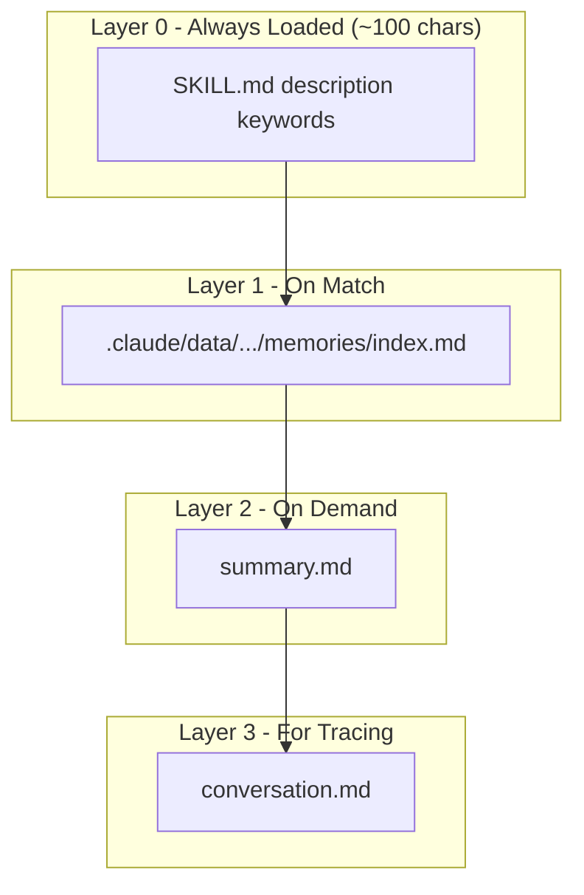

# Conversation Memory Skill

> A memory system for Claude Code built on Claude Skills - Save and recall conversation context automatically with progressive loading.

[](https://nodejs.org/)
[](LICENSE)
[](https://docs.anthropic.com/)

## Why This Approach?

**Traditional memory solutions** (vector databases, RAG, external services) require infrastructure, cost money, and add complexity.

**This project's insight**: Claude Skills already IS a memory system - keyword triggers, structured storage, progressive loading, cross-session persistence. We just use it differently.

**Result**:
- **Minimal** - Zero dependencies, zero cost, copy-and-use
- **Extensible** - Add vector search later if needed, not required to start

## Features

- **Single Skill Architecture** - Only one skill is loaded; memories are stored as plain files
- **Code/Data Separation** - Skill code and memory data stored in separate directories for easy migration
- **Dynamic Indexing** - Main skill contains an index table and keywords for active memories
- **Four-Layer Loading** - Progressive disclosure: description → index → summary → conversation
- **Auto Recall** - Automatically find relevant memories based on keyword matching
- **Heat Management** - Frequently used memories stay active; inactive ones get archived

## Quick Start

### Prerequisites

- Node.js 18+
- Claude Code with Skills support

### Installation

Copy the skill directory to your project's `.claude/skills/` folder:

```bash
# Clone or download this repository
git clone https://github.com/imjszhang/conversation-memory-skill.git

# Copy to your project
cp -r conversation-memory-skill/skills/conversation-memory /path/to/project/.claude/skills/
```

### Basic Usage

Just say one of these phrases in your conversation:

- "Save this conversation"
- "Remember this discussion"
- "Store the context"

Claude will automatically:
1. Extract key information and generate a summary
2. Save the raw conversation for traceability
3. Update the skill index

## Architecture



### How It Works

| Layer | File | When Loaded | Purpose |
|-------|------|-------------|---------|
| 0 | SKILL.md description | Always | Keywords for matching |
| 1 | .claude/data/.../memories/index.md | On skill match | Index table of active memories |
| 2 | summary.md | On demand | Detailed summary of a memory |
| 3 | conversation.md | For tracing | Full raw conversation |

> **Note**: Memory data is stored in `.claude/data/conversation-memory/` (separate from skill code in `.claude/skills/`). The data directory is automatically created on first use.

## Usage

### Saving Memories

```bash
cd skills/conversation-memory

# Auto-generate memory name
node scripts/save_memory.js

# Specify memory name
node scripts/save_memory.js mem-20260111-143000
```

### Recalling Memories

Memories are recalled through the index mechanism:

1. Claude checks keywords in the skill description
2. Reads the index table to find matching memories
3. Loads the relevant `summary.md` for details
4. Reads `conversation.md` if full context is needed

### Managing Archives

```bash
# List archived memories
node scripts/activate_memory.js --list

# Search memories
node scripts/activate_memory.js --search keyword

# Activate an archived memory
node scripts/activate_memory.js mem-20260111-143000

# View statistics
node scripts/archive_old_memories.js --stats

# Preview archiving (dry run)
node scripts/archive_old_memories.js --dry-run

# Execute archiving
node scripts/archive_old_memories.js
```

### Archive Rules

- Memories inactive for 14+ days are automatically archived
- Maximum 20 active memories
- Archived memories are searchable and can be reactivated
- Reactivated memories appear in the index again

## File Structure

### Repository Structure

```
conversation-memory-skill/
├── README.md
├── LICENSE
├── docs/                               # Documentation
└── skills/
    ├── conversation-memory/            # English version
    │   ├── SKILL.md
    │   ├── scripts/
    │   └── references/
    └── conversation-memory-zh/         # Chinese version
        ├── SKILL.md
        ├── scripts/
        └── references/
```

### Deployed Structure (Code/Data Separation)

After deployment, skill code and data are stored separately:

```
your-project/
└── .claude/
    ├── skills/conversation-memory/     # Skill code (from template)
    │   ├── SKILL.md                    # Skill definition
    │   ├── scripts/
    │   │   ├── paths.js                # Path resolution utility
    │   │   ├── save_memory.js          # Save memory
    │   │   ├── activate_memory.js      # Activate/search memories
    │   │   ├── archive_old_memories.js # Archive management
    │   │   └── update_index.js         # Update index
    │   └── references/
    │       ├── summary_template.md     # Summary template
    │       └── conversation_template.md # Conversation template
    │
    └── data/conversation-memory/       # Data directory (auto-created)
        └── memories/
            ├── index.md                # Active memory index
            ├── active/                 # Active memories
            │   └── mem-{timestamp}/
            │       ├── summary.md
            │       └── conversation.md
            └── archive/                # Archived memories
```

> **Why Separate?** This design makes skill upgrades safe - updating skill code won't affect your saved memories.

## Memory File Format

### summary.md

```markdown
# Conversation Memory: Topic Title

## Metadata
- **Time**: 2026-01-11 14:07
- **Keywords**: skills, memory, recall

## Summary
Brief description of the conversation...

## Key Decisions
1. Decision 1
2. Decision 2

## Tracing
See conversation.md for full context
```

### conversation.md

```markdown
# Raw Conversation Log

## Info
- Start: 2026-01-11 14:00
- End: 2026-01-11 14:30
- Turns: 15

## Content
### User [14:00:00]
...

### Claude [14:00:15]
...
```

## Design Philosophy

### Why Single Skill + Index Pattern?

The original approach (each memory as a separate skill) had issues:
- Claude Skills loads ALL skill descriptions
- More memories = more metadata bloat
- Even archived memories were loaded

The new approach solves these:
- Only one skill is loaded
- Memories are plain files, not skills
- Archived memories are completely unloaded
- Fast lookup through index table

### Why Code/Data Separation?

Storing memories inside the skill directory caused problems:
- Skill updates would overwrite memories
- Skill directory grows unboundedly
- Hard to backup/migrate memories independently

The new structure (`paths.js` + `.claude/data/`) solves these:
- Skill code can be safely upgraded
- Data directory is auto-created on first use
- Memories can be backed up independently
- Easy to migrate between projects

### Mimicking Human Memory

- **Automatic** - Naturally save without explicit commands
- **Redundant** - Multiple saves of same topic is fine
- **Use It or Lose It** - Active memories stay, inactive ones archive
- **Progressive Recall** - Remember the gist first, details on demand

## Documentation

- [Design Evolution](docs/design-evolution.md) - How the design evolved through iterations
- [Technical Deep Dive](docs/technical-deep-dive.md) - Detailed technical documentation

## Feedback & Community

We welcome any feedback and suggestions! You can reach us through the following channels:

- **GitHub Issues**: [Submit issues or suggestions](https://github.com/imjszhang/conversation-memory-skill/issues)
- **Twitter/X**: [@imjszhang](https://x.com/imjszhang)

## Contributing

Contributions are welcome! Please feel free to submit a Pull Request.

## License

MIT License - see [LICENSE](LICENSE) for details.

---

**Built with Claude Skills** | [Report Issues](https://github.com/imjszhang/conversation-memory-skill/issues) | [Twitter/X](https://x.com/imjszhang)
