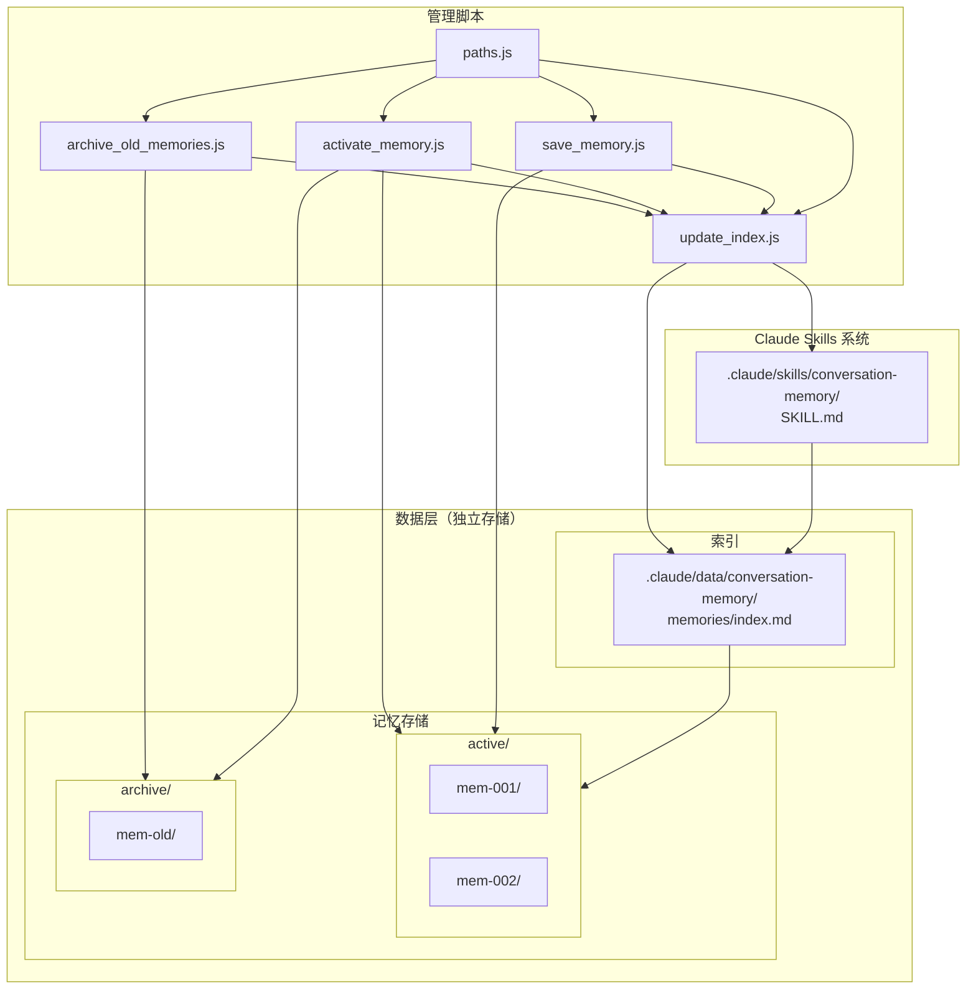
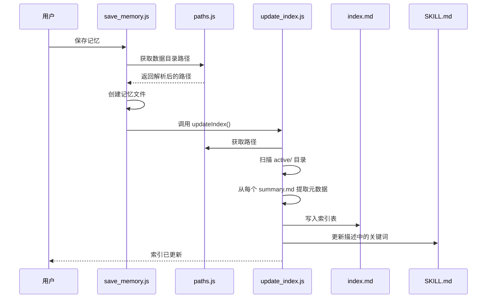
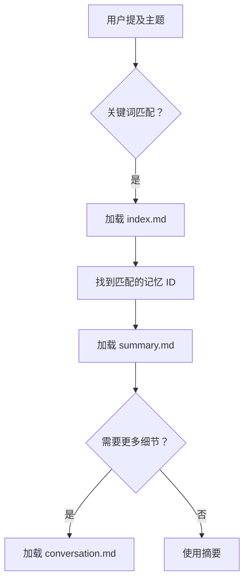

# 技术深度解析：对话记忆技能

> 详细的架构、实现和关键设计决策技术文档。

## 架构概览



## 代码/数据分离设计

核心设计原则：**技能代码和用户数据分开存储**。

```
.claude/
├── skills/conversation-memory/    # 技能代码（模板，可升级）
└── data/conversation-memory/      # 用户数据（升级时保留）
```

### 为什么要分离？

| 问题 | 传统方式 | 分离后 |
|------|----------|--------|
| 技能升级 | 会覆盖记忆数据 | 安全，数据不受影响 |
| 备份 | 必须备份整个技能 | 只需备份数据目录 |
| 迁移 | 复杂的路径重写 | 复制数据目录即可 |
| 版本控制 | 代码+数据混合提交 | 干净的纯代码提交 |

### 路径解析（`paths.js`）

`paths.js` 模块提供统一的路径解析：

```javascript
const { 
  getSkillDir,     // .claude/skills/conversation-memory/
  getDataDir,      // .claude/data/conversation-memory/
  getMemoriesDir,  // .claude/data/conversation-memory/memories/
  getActiveDir,    // .../memories/active/
  getArchiveDir,   // .../memories/archive/
  getIndexFile,    // .../memories/index.md
  getSkillFile,    // .../SKILL.md
  ensureDataDir,   // 创建数据目录结构
  getConfig        // 获取配置对象
} = require('./paths');
```

核心函数 - 向上遍历查找 `.claude` 根目录：

```javascript
function findClaudeRoot(startDir = __dirname) {
  let currentDir = path.resolve(startDir);
  const root = path.parse(currentDir).root;
  
  while (currentDir !== root) {
    const claudeDir = path.join(currentDir, '.claude');
    if (fs.existsSync(claudeDir) && fs.statSync(claudeDir).isDirectory()) {
      return claudeDir;
    }
    currentDir = path.dirname(currentDir);
  }
  
  return null;
}
```

## 四层加载机制

系统实现了渐进式披露模式，分为四个层次：

### 第 0 层：描述关键词（始终加载）

**文件**：`SKILL.md`（YAML frontmatter 中的 `description` 字段）

**大小**：约 100 字符

**内容**：
```yaml
description: >
  对话记忆管理。当用户说"保存记忆"时触发...
  活跃记忆关键词：react, hooks, performance
```

**何时加载**：始终 - 这是 Claude 在会话开始时加载的技能元数据的一部分。

**用途**：提供关键词供 Claude 匹配用户消息，决定是否激活此技能。

### 第 1 层：索引表（技能匹配时）

**文件**：`.claude/data/conversation-memory/memories/index.md`

**大小**：约 500-2000 字符（取决于活跃记忆数量）

**内容**：
```markdown
## 索引表

| 记忆 ID | 主题 | 关键词 | 日期 |
|---------|------|--------|------|
| mem-20260111-143000 | React Hooks 优化 | hooks, memo, useCallback | 2026-01-11 |
| mem-20260110-091500 | API 设计讨论 | rest, graphql, versioning | 2026-01-10 |
```

**何时加载**：当技能被激活（关键词匹配）时。

**用途**：快速查找表，无需加载完整内容即可找到相关记忆。

### 第 2 层：摘要（按需）

**文件**：`.claude/data/conversation-memory/memories/active/{mem-id}/summary.md`

**大小**：每个记忆约 500-1500 字符

**内容**：
```markdown
# 对话记忆：React Hooks 优化

## 元信息
- **时间**：2026-01-11 14:30
- **关键词**：hooks, memo, useCallback, performance

## 主题摘要
讨论了 React hooks 的性能优化策略...

## 关键决策
1. 对昂贵的计算使用 useMemo
2. 对传递给子组件的事件处理器使用 useCallback
```

**何时加载**：当 Claude 确定此特定记忆相关时。

**用途**：提供详细上下文，无需加载完整对话。

### 第 3 层：原始对话（用于溯源）

**文件**：`.claude/data/conversation-memory/memories/active/{mem-id}/conversation.md`

**大小**：可变（可能很大）

**内容**：带时间戳的完整原始对话日志。

**何时加载**：仅在需要完整历史上下文进行溯源时。

**用途**：完整的可追溯性和事实来源。

## 动态索引系统

`update_index.js` 脚本是动态索引系统的核心。

### 关键函数

#### `extractMemoryInfo(summaryPath)`

从记忆的 `summary.md` 提取元数据，同时支持中英文格式：

```javascript
function extractMemoryInfo(summaryPath) {
  const content = fs.readFileSync(summaryPath, 'utf8');
  
  // 提取主题（标题）- 同时支持中英文格式
  let topic = 'Unknown Topic';
  const titleMatchEn = content.match(/^# Conversation Memory:\s*(.+)$/m);
  const titleMatchZh = content.match(/^# 对话记忆：(.+)$/m);
  if (titleMatchEn) {
    topic = titleMatchEn[1].trim();
  } else if (titleMatchZh) {
    topic = titleMatchZh[1].trim();
  }
  
  // 提取关键词 - 支持两种格式
  let keywords = '';
  const keywordsMatchEn = content.match(/\*\*Keywords\*\*:\s*(.+)$/m);
  const keywordsMatchZh = content.match(/\*\*关键词\*\*：(.+)$/m);
  if (keywordsMatchEn) {
    keywords = keywordsMatchEn[1].trim();
  } else if (keywordsMatchZh) {
    keywords = keywordsMatchZh[1].trim();
  }
  
  // 提取时间 - 支持两种格式
  let time = '';
  const timeMatchEn = content.match(/\*\*Time\*\*:\s*(.+)$/m);
  const timeMatchZh = content.match(/\*\*时间\*\*：(.+)$/m);
  if (timeMatchEn) {
    time = timeMatchEn[1].trim().split(' ')[0];
  } else if (timeMatchZh) {
    time = timeMatchZh[1].trim().split(' ')[0];
  }
  
  return { topic, keywords, time };
}
```

#### `collectAllKeywords(memories)`

汇总所有活跃记忆的关键词，过滤掉模板占位符：

```javascript
function collectAllKeywords(memories) {
  const keywordSet = new Set();
  
  // 需要过滤的模板占位符（中英文）
  const placeholders = [
    '{keyword1}', '{keyword2}', '{keyword3}',
    '{关键词1}', '{关键词2}', '{关键词3}'
  ];
  
  for (const mem of memories) {
    if (mem.keywords) {
      const keywords = mem.keywords.split(/[,，]/).map(k => k.trim());
      keywords.forEach(k => {
        if (k && !placeholders.includes(k)) {
          keywordSet.add(k);
        }
      });
    }
  }
  
  return Array.from(keywordSet);
}
```

#### `updateIndexFile(memories)`

生成 `memories/index.md` 文件：

```javascript
function updateIndexFile(memories) {
  const indexTable = generateIndexTable(memories);
  const allKeywords = collectAllKeywords(memories);
  const keywordsStr = allKeywords.length > 0 
    ? allKeywords.join(', ')
    : '(暂无有效关键词)';
  
  const content = `# 活跃记忆索引

> 此文件由脚本自动更新。

## 索引表

<!-- INDEX_START -->
${indexTable}
<!-- INDEX_END -->

## 关键词汇总

<!-- KEYWORDS_START -->
${keywordsStr}
<!-- KEYWORDS_END -->
`;

  fs.writeFileSync(CONFIG.indexFile, content, 'utf8');
}
```

#### `updateSkillFile(memories)`

使用当前关键词更新 `SKILL.md` 描述：

```javascript
function updateSkillFile(memories) {
  let content = fs.readFileSync(CONFIG.skillFile, 'utf8');
  
  const allKeywords = collectAllKeywords(memories);
  const keywordsStr = allKeywords.length > 0 
    ? allKeywords.slice(0, 15).join(', ')  // 最多 15 个关键词
    : '(no active memories)';
  
  // 支持中英文格式
  content = content.replace(
    /Active memory keywords:\s*.+/,
    `Active memory keywords: ${keywordsStr}`
  );
  
  fs.writeFileSync(CONFIG.skillFile, content, 'utf8');
}
```

### 更新流程



## 记忆生命周期

### 1. 创建（save_memory.js）


**创建的目录**：
```
.claude/data/conversation-memory/memories/active/mem-20260111-143000/
├── summary.md      # 供用户填写的模板
└── conversation.md # 原始对话模板
```

### 2. 召回



### 3. 归档（archive_old_memories.js）

**条件**：
- 记忆超过 14 天未活跃（基于文件修改时间）
- 活跃记忆数量超过 20 个

**处理过程**：
```javascript
function archiveMemory(memory) {
  ensureDataDir();
  
  const archiveDir = path.join(CONFIG.memoriesDir, CONFIG.archiveDir);
  const targetPath = path.join(archiveDir, memory.name);
  
  // 移动目录
  fs.renameSync(memory.path, targetPath);
  
  return targetPath;
}
```

### 4. 重新激活（activate_memory.js）

```javascript
function activateMemory(memoryName) {
  ensureDataDir();
  
  const archivePath = path.join(CONFIG.memoriesDir, CONFIG.archiveDir, memoryName);
  const activePath = path.join(CONFIG.memoriesDir, CONFIG.activeDir, memoryName);
  
  // 检查是否在归档中
  if (!fs.existsSync(archivePath)) {
    if (fs.existsSync(activePath)) {
      console.log(`记忆 ${memoryName} 已经是活跃状态`);
      return;
    }
    throw new Error(`未找到记忆 ${memoryName}`);
  }
  
  // 移回活跃目录
  fs.renameSync(archivePath, activePath);
  
  // 更新索引
  updateIndex();
}
```

## 文件结构详解

### 仓库结构

```
conversation-memory-skill/           # 仓库根目录
├── README.md                        # 主文档
├── LICENSE
├── package.json
├── docs/
│   ├── design-evolution.md          # 设计演进历史
│   ├── design-evolution-zh.md       # 中文版
│   ├── technical-deep-dive.md       # 技术深度解析
│   └── technical-deep-dive-zh.md    # 中文版（本文档）
└── skills/
    ├── conversation-memory/         # 英文版
    │   ├── SKILL.md                 # 技能定义
    │   ├── scripts/
    │   │   ├── paths.js             # 路径解析工具
    │   │   ├── save_memory.js
    │   │   ├── activate_memory.js
    │   │   ├── archive_old_memories.js
    │   │   └── update_index.js
    │   └── references/
    │       ├── summary_template.md
    │       └── conversation_template.md
    └── conversation-memory-zh/      # 中文版
        ├── SKILL.md
        ├── scripts/
        └── references/
```

### 部署后的结构（安装后）

```
your-project/
└── .claude/
    ├── skills/conversation-memory/  # 技能代码（来自模板）
    │   ├── SKILL.md
    │   ├── scripts/
    │   │   ├── paths.js             # 路径解析工具
    │   │   ├── save_memory.js
    │   │   ├── activate_memory.js
    │   │   ├── archive_old_memories.js
    │   │   └── update_index.js
    │   └── references/
    │       ├── summary_template.md
    │       └── conversation_template.md
    │
    └── data/conversation-memory/    # 数据目录（自动创建）
        └── memories/
            ├── index.md             # 活跃记忆索引
            ├── active/              # 活跃记忆
            │   └── mem-{timestamp}/
            │       ├── summary.md
            │       └── conversation.md
            └── archive/             # 归档记忆
                └── mem-{timestamp}/
```

## 性能考量

### 为什么这个设计高效

| 方面 | 原始版本 (V1) | 当前版本 (V3) |
|------|---------------|---------------|
| 加载的技能数 | N（每个记忆一个） | 1（始终） |
| 元数据开销 | O(N) | O(1) |
| 归档效果 | 无（仍被加载） | 完全（不被加载） |
| 索引更新 | N 个文件 | 2 个文件 |
| 升级安全性 | 有数据丢失风险 | 数据得以保留 |

### 扩展特性

- **活跃记忆**：索引中 O(N) 空间，每次查找 O(1)
- **归档记忆**：O(0) 运行时开销
- **关键词匹配**：O(K)，其中 K = 总关键词数（描述中限制为 15 个）

### 记忆限制

推荐的最佳性能限制：
- 活跃记忆：≤ 20 个
- 每个记忆的关键词：≤ 8 个
- 描述中的关键词：≤ 15 个
- 摘要大小：≤ 2000 字符

## 扩展点

### 添加语义搜索

用嵌入向量替代关键词匹配：

```javascript
// 潜在的未来增强
async function findSimilarMemories(query) {
  const embedding = await getEmbedding(query);
  const memories = getActiveMemories();
  
  return memories
    .map(m => ({
      ...m,
      similarity: cosineSimilarity(embedding, m.embedding)
    }))
    .sort((a, b) => b.similarity - a.similarity)
    .slice(0, 5);
}
```

### 自动摘要

自动压缩旧摘要：

```javascript
async function compressMemory(memoryId) {
  const summary = readSummary(memoryId);
  const compressed = await llmSummarize(summary, { maxLength: 500 });
  writeSummary(memoryId, compressed);
}
```

### 跨项目记忆

使用数据目录在项目间共享记忆：

```javascript
// 由于数据与技能代码分离，共享更简单
const SHARED_DATA_PATH = '~/.claude/shared-data/conversation-memory/';

function linkSharedMemory(memoryId) {
  const sharedPath = path.join(SHARED_DATA_PATH, 'memories', 'active', memoryId);
  const localPath = path.join(getActiveDir(), memoryId);
  fs.symlinkSync(sharedPath, localPath);
}
```

## 故障排除

### 索引不更新

1. 检查文件权限
2. 验证 `summary.md` 格式是否匹配预期模式（支持中英文）
3. 手动运行 `node scripts/update_index.js`
4. 检查工作区中是否存在 `.claude` 目录

### 关键词不匹配

1. 检查 `SKILL.md` 描述格式
2. 验证关键词不包含特殊字符
3. 确保关键词以逗号分隔（支持 `,` 和 `，`）

### 找不到记忆

1. 检查记忆是否在 `archive/` 而不是 `active/` 中
2. 运行 `node scripts/activate_memory.js --list` 查看归档记忆
3. 使用 `--search` 按关键词搜索

### 数据目录问题

1. 运行 `ensureDataDir()` 创建目录结构
2. 检查 `.claude/data/conversation-memory/` 是否存在
3. 验证数据目录的写入权限

---

*有关设计原理和演进历史，请参阅 [设计演进](design-evolution-zh.md)。*
