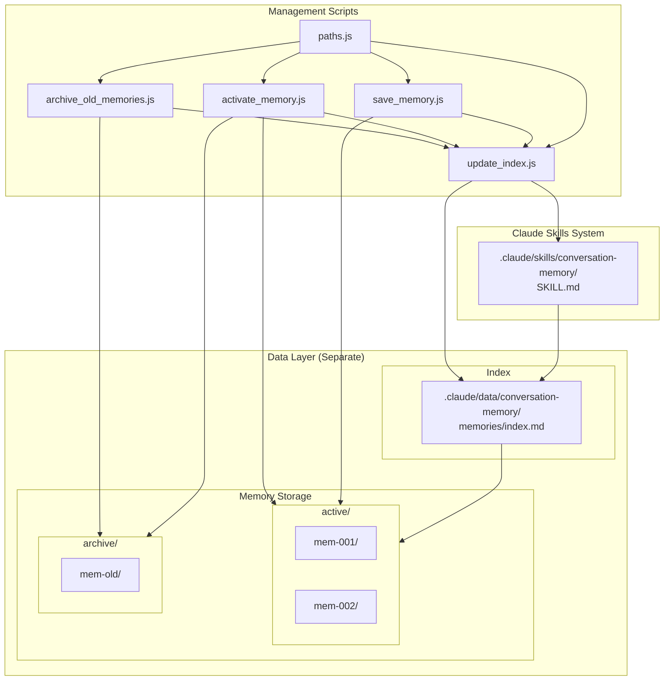
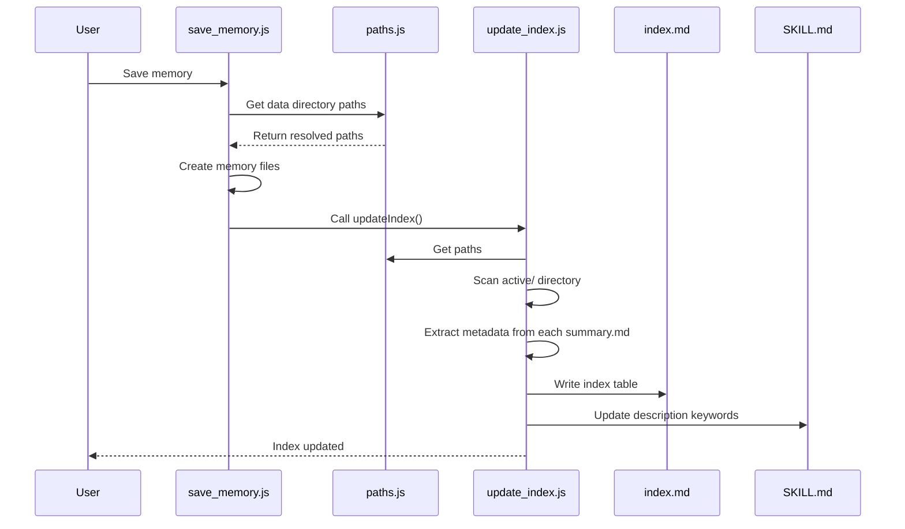
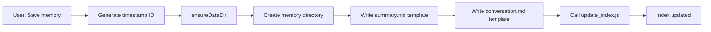
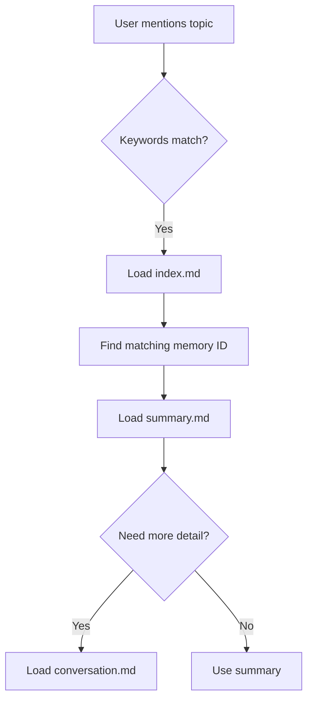

# Technical Deep Dive: Conversation Memory Skill

> A detailed technical documentation of the architecture, implementation, and key design decisions.

## Architecture Overview



## Code/Data Separation Design

A core design principle: **skill code and user data are stored separately**.

```
.claude/
├── skills/conversation-memory/    # Skill code (template, can be upgraded)
└── data/conversation-memory/      # User data (persists across upgrades)
```

### Why Separation?

| Problem | Traditional | With Separation |
|---------|-------------|-----------------|
| Skill upgrade | Overwrites memory data | Safe, data untouched |
| Backup | Must backup entire skill | Data directory only |
| Migration | Complex path rewriting | Copy data directory |
| Version control | Mixed code+data commits | Clean code-only commits |

### Path Resolution (`paths.js`)

The `paths.js` module provides unified path resolution:

```javascript
const { 
  getSkillDir,     // .claude/skills/conversation-memory/
  getDataDir,      // .claude/data/conversation-memory/
  getMemoriesDir,  // .claude/data/conversation-memory/memories/
  getActiveDir,    // .../memories/active/
  getArchiveDir,   // .../memories/archive/
  getIndexFile,    // .../memories/index.md
  getSkillFile,    // .../SKILL.md
  ensureDataDir,   // Create data directory structure
  getConfig        // Get configuration object
} = require('./paths');
```

Key function - finding `.claude` root by traversing up:

```javascript
function findClaudeRoot(startDir = __dirname) {
  let currentDir = path.resolve(startDir);
  const root = path.parse(currentDir).root;
  
  while (currentDir !== root) {
    const claudeDir = path.join(currentDir, '.claude');
    if (fs.existsSync(claudeDir) && fs.statSync(claudeDir).isDirectory()) {
      return claudeDir;
    }
    currentDir = path.dirname(currentDir);
  }
  
  return null;
}
```

## Four-Layer Loading Mechanism

The system implements a progressive disclosure pattern with four distinct layers:

### Layer 0: Description Keywords (Always Loaded)

**File**: `SKILL.md` (YAML frontmatter `description` field)

**Size**: ~100 characters

**Content**:
```yaml
description: >
  Conversation memory management. Triggers when user says "save memory"...
  Active memory keywords: react, hooks, performance
```

**When Loaded**: Always - this is part of the skill metadata that Claude loads at conversation start.

**Purpose**: Provides keywords for Claude to match against user messages and decide whether to activate this skill.

### Layer 1: Index Table (On Skill Match)

**File**: `.claude/data/conversation-memory/memories/index.md`

**Size**: ~500-2000 characters (depending on active memory count)

**Content**:
```markdown
## Index Table

| Memory ID | Topic | Keywords | Date |
|-----------|-------|----------|------|
| mem-20260111-143000 | React Hooks Optimization | hooks, memo, useCallback | 2026-01-11 |
| mem-20260110-091500 | API Design Discussion | rest, graphql, versioning | 2026-01-10 |
```

**When Loaded**: When the skill is activated (keywords match).

**Purpose**: Quick lookup table to find relevant memories without loading full content.

### Layer 2: Summary (On Demand)

**File**: `.claude/data/conversation-memory/memories/active/{mem-id}/summary.md`

**Size**: ~500-1500 characters per memory

**Content**:
```markdown
# Conversation Memory: React Hooks Optimization

## Metadata
- **Time**: 2026-01-11 14:30
- **Keywords**: hooks, memo, useCallback, performance

## Summary
Discussed performance optimization strategies for React hooks...

## Key Decisions
1. Use useMemo for expensive calculations
2. Implement useCallback for event handlers passed to children
```

**When Loaded**: When Claude determines this specific memory is relevant.

**Purpose**: Provides detailed context without loading the full conversation.

### Layer 3: Raw Conversation (For Tracing)

**File**: `.claude/data/conversation-memory/memories/active/{mem-id}/conversation.md`

**Size**: Variable (can be large)

**Content**: Full raw conversation log with timestamps.

**When Loaded**: Only when full historical context is needed for tracing.

**Purpose**: Complete traceability and source of truth.

## Dynamic Index System

The `update_index.js` script is the core of the dynamic indexing system.

### Key Functions

#### `extractMemoryInfo(summaryPath)`

Extracts metadata from a memory's `summary.md`, supporting both English and Chinese formats:

```javascript
function extractMemoryInfo(summaryPath) {
  const content = fs.readFileSync(summaryPath, 'utf8');
  
  // Extract topic (title) - support both English and Chinese formats
  let topic = 'Unknown Topic';
  const titleMatchEn = content.match(/^# Conversation Memory:\s*(.+)$/m);
  const titleMatchZh = content.match(/^# 对话记忆：(.+)$/m);
  if (titleMatchEn) {
    topic = titleMatchEn[1].trim();
  } else if (titleMatchZh) {
    topic = titleMatchZh[1].trim();
  }
  
  // Extract keywords - support both formats
  let keywords = '';
  const keywordsMatchEn = content.match(/\*\*Keywords\*\*:\s*(.+)$/m);
  const keywordsMatchZh = content.match(/\*\*关键词\*\*：(.+)$/m);
  if (keywordsMatchEn) {
    keywords = keywordsMatchEn[1].trim();
  } else if (keywordsMatchZh) {
    keywords = keywordsMatchZh[1].trim();
  }
  
  // Extract time - support both formats
  let time = '';
  const timeMatchEn = content.match(/\*\*Time\*\*:\s*(.+)$/m);
  const timeMatchZh = content.match(/\*\*时间\*\*：(.+)$/m);
  if (timeMatchEn) {
    time = timeMatchEn[1].trim().split(' ')[0];
  } else if (timeMatchZh) {
    time = timeMatchZh[1].trim().split(' ')[0];
  }
  
  return { topic, keywords, time };
}
```

#### `collectAllKeywords(memories)`

Aggregates all keywords from active memories, filtering out template placeholders:

```javascript
function collectAllKeywords(memories) {
  const keywordSet = new Set();
  
  // Template placeholders to filter out (both English and Chinese)
  const placeholders = [
    '{keyword1}', '{keyword2}', '{keyword3}',
    '{关键词1}', '{关键词2}', '{关键词3}'
  ];
  
  for (const mem of memories) {
    if (mem.keywords) {
      const keywords = mem.keywords.split(/[,，]/).map(k => k.trim());
      keywords.forEach(k => {
        if (k && !placeholders.includes(k)) {
          keywordSet.add(k);
        }
      });
    }
  }
  
  return Array.from(keywordSet);
}
```

#### `updateIndexFile(memories)`

Generates the `memories/index.md` file:

```javascript
function updateIndexFile(memories) {
  const indexTable = generateIndexTable(memories);
  const allKeywords = collectAllKeywords(memories);
  const keywordsStr = allKeywords.length > 0 
    ? allKeywords.join(', ')
    : '(No valid keywords yet)';
  
  const content = `# Active Memory Index

> This file is automatically updated by scripts.

## Index Table

<!-- INDEX_START -->
${indexTable}
<!-- INDEX_END -->

## Keywords Summary

<!-- KEYWORDS_START -->
${keywordsStr}
<!-- KEYWORDS_END -->
`;

  fs.writeFileSync(CONFIG.indexFile, content, 'utf8');
}
```

#### `updateSkillFile(memories)`

Updates the `SKILL.md` description with current keywords:

```javascript
function updateSkillFile(memories) {
  let content = fs.readFileSync(CONFIG.skillFile, 'utf8');
  
  const allKeywords = collectAllKeywords(memories);
  const keywordsStr = allKeywords.length > 0 
    ? allKeywords.slice(0, 15).join(', ')  // Max 15 keywords
    : '(no active memories)';
  
  // Support both English and Chinese formats
  content = content.replace(
    /Active memory keywords:\s*.+/,
    `Active memory keywords: ${keywordsStr}`
  );
  
  fs.writeFileSync(CONFIG.skillFile, content, 'utf8');
}
```

### Update Flow



## Memory Lifecycle

### 1. Creation (save_memory.js)



**Directory created**:
```
.claude/data/conversation-memory/memories/active/mem-20260111-143000/
├── summary.md      # Template for user to fill
└── conversation.md # Template for raw conversation
```

### 2. Recall



### 3. Archiving (archive_old_memories.js)

**Criteria**:
- Memory inactive for 14+ days (based on file modification time)
- Active memory count exceeds 20

**Process**:
```javascript
function archiveMemory(memory) {
  ensureDataDir();
  
  const archiveDir = path.join(CONFIG.memoriesDir, CONFIG.archiveDir);
  const targetPath = path.join(archiveDir, memory.name);
  
  // Move directory
  fs.renameSync(memory.path, targetPath);
  
  return targetPath;
}
```

### 4. Reactivation (activate_memory.js)

```javascript
function activateMemory(memoryName) {
  ensureDataDir();
  
  const archivePath = path.join(CONFIG.memoriesDir, CONFIG.archiveDir, memoryName);
  const activePath = path.join(CONFIG.memoriesDir, CONFIG.activeDir, memoryName);
  
  // Check if in archive
  if (!fs.existsSync(archivePath)) {
    if (fs.existsSync(activePath)) {
      console.log(`Memory ${memoryName} is already active`);
      return;
    }
    throw new Error(`Memory ${memoryName} not found`);
  }
  
  // Move back to active
  fs.renameSync(archivePath, activePath);
  
  // Update index
  updateIndex();
}
```

## File Structure Details

### Repository Structure

```
conversation-memory-skill/           # Repository root
├── README.md                        # Main documentation
├── LICENSE
├── package.json
├── docs/
│   ├── design-evolution.md          # Design evolution history
│   ├── design-evolution-zh.md       # Chinese version
│   ├── technical-deep-dive.md       # This document
│   └── technical-deep-dive-zh.md    # Chinese version
└── skills/
    ├── conversation-memory/         # English version
    │   ├── SKILL.md                 # Skill definition
    │   ├── scripts/
    │   │   ├── paths.js             # Path resolution utility
    │   │   ├── save_memory.js
    │   │   ├── activate_memory.js
    │   │   ├── archive_old_memories.js
    │   │   └── update_index.js
    │   └── references/
    │       ├── summary_template.md
    │       └── conversation_template.md
    └── conversation-memory-zh/      # Chinese version
        ├── SKILL.md
        ├── scripts/
        └── references/
```

### Deployed Structure (After Installation)

```
your-project/
└── .claude/
    ├── skills/conversation-memory/  # Skill code (from template)
    │   ├── SKILL.md
    │   ├── scripts/
    │   │   ├── paths.js             # Path resolution utility
    │   │   ├── save_memory.js
    │   │   ├── activate_memory.js
    │   │   ├── archive_old_memories.js
    │   │   └── update_index.js
    │   └── references/
    │       ├── summary_template.md
    │       └── conversation_template.md
    │
    └── data/conversation-memory/    # Data directory (auto-created)
        └── memories/
            ├── index.md             # Active memory index
            ├── active/              # Active memories
            │   └── mem-{timestamp}/
            │       ├── summary.md
            │       └── conversation.md
            └── archive/             # Archived memories
                └── mem-{timestamp}/
```

## Performance Considerations

### Why This Design is Efficient

| Aspect | Original (V1) | Current (V3) |
|--------|---------------|--------------|
| Skills loaded | N (one per memory) | 1 (always) |
| Metadata overhead | O(N) | O(1) |
| Archive effectiveness | None (still loaded) | Complete (not loaded) |
| Index update | N files | 2 files |
| Upgrade safety | Risk of data loss | Data preserved |

### Scaling Characteristics

- **Active memories**: O(N) space in index, O(1) for each lookup
- **Archived memories**: O(0) runtime overhead
- **Keyword matching**: O(K) where K = total keywords (capped at 15 in description)

### Memory Limits

Recommended limits for optimal performance:
- Active memories: ≤ 20
- Keywords per memory: ≤ 8
- Description keywords: ≤ 15
- Summary size: ≤ 2000 characters

## Extension Points

### Adding Semantic Search

Replace keyword matching with embeddings:

```javascript
// Potential future enhancement
async function findSimilarMemories(query) {
  const embedding = await getEmbedding(query);
  const memories = getActiveMemories();
  
  return memories
    .map(m => ({
      ...m,
      similarity: cosineSimilarity(embedding, m.embedding)
    }))
    .sort((a, b) => b.similarity - a.similarity)
    .slice(0, 5);
}
```

### Auto-Summarization

Automatically compress old summaries:

```javascript
async function compressMemory(memoryId) {
  const summary = readSummary(memoryId);
  const compressed = await llmSummarize(summary, { maxLength: 500 });
  writeSummary(memoryId, compressed);
}
```

### Cross-Project Memory

Share memories between projects using the data directory:

```javascript
// Since data is separate from skill code, sharing is simpler
const SHARED_DATA_PATH = '~/.claude/shared-data/conversation-memory/';

function linkSharedMemory(memoryId) {
  const sharedPath = path.join(SHARED_DATA_PATH, 'memories', 'active', memoryId);
  const localPath = path.join(getActiveDir(), memoryId);
  fs.symlinkSync(sharedPath, localPath);
}
```

## Troubleshooting

### Index Not Updating

1. Check file permissions
2. Verify `summary.md` format matches expected patterns (supports both English and Chinese)
3. Run `node scripts/update_index.js` manually
4. Check if `.claude` directory exists in workspace

### Keywords Not Matching

1. Check `SKILL.md` description format
2. Verify keywords don't contain special characters
3. Ensure keywords are comma-separated (supports both `,` and `，`)

### Memory Not Found

1. Check if memory is in `archive/` instead of `active/`
2. Run `node scripts/activate_memory.js --list` to see archived memories
3. Use `--search` to find by keyword

### Data Directory Issues

1. Run `ensureDataDir()` to create the directory structure
2. Check if `.claude/data/conversation-memory/` exists
3. Verify write permissions on the data directory

---

*For design rationale and evolution history, see [Design Evolution](design-evolution.md).*
