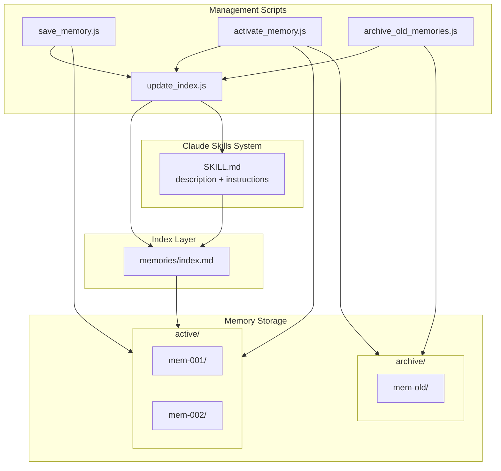
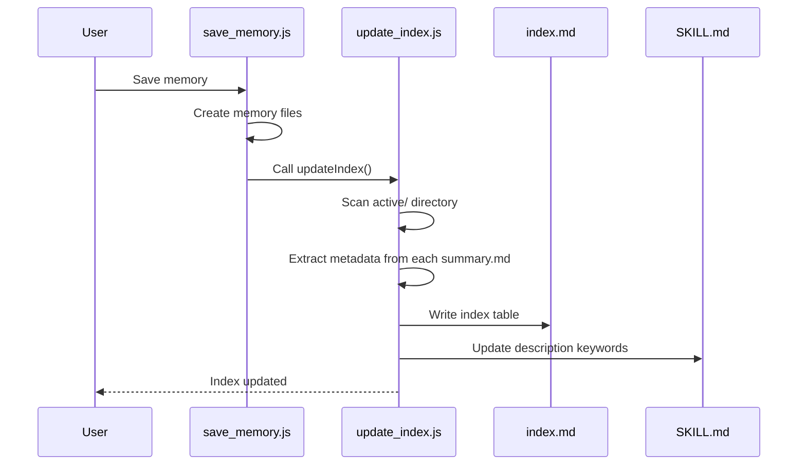
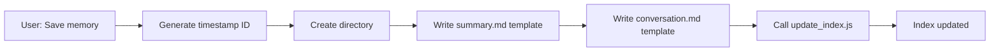
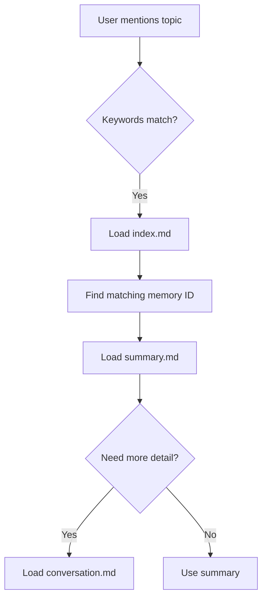

# Technical Deep Dive: Conversation Memory Skill

> A detailed technical documentation of the architecture, implementation, and key design decisions.

## Architecture Overview



## Four-Layer Loading Mechanism

The system implements a progressive disclosure pattern with four distinct layers:

### Layer 0: Description Keywords (Always Loaded)

**File**: `SKILL.md` (YAML frontmatter `description` field)

**Size**: ~100 characters

**Content**:
```yaml
description: >
  Memory management. Trigger phrases: save memory, recall discussion.
  Active keywords: react, hooks, performance, debugging, api-design
```

**When Loaded**: Always - this is part of the skill metadata that Claude loads at conversation start.

**Purpose**: Provides keywords for Claude to match against user messages and decide whether to activate this skill.

### Layer 1: Index Table (On Skill Match)

**File**: `memories/index.md`

**Size**: ~500-2000 characters (depending on active memory count)

**Content**:
```markdown
## Index Table

| ID | Topic | Keywords | Date |
|----|-------|----------|------|
| mem-20260111-143000 | React Hooks Optimization | hooks, memo, useCallback | 2026-01-11 |
| mem-20260110-091500 | API Design Discussion | rest, graphql, versioning | 2026-01-10 |
```

**When Loaded**: When the skill is activated (keywords match).

**Purpose**: Quick lookup table to find relevant memories without loading full content.

### Layer 2: Summary (On Demand)

**File**: `memories/active/{mem-id}/summary.md`

**Size**: ~500-1500 characters per memory

**Content**:
```markdown
# Conversation Memory: React Hooks Optimization

## Metadata
- **Time**: 2026-01-11 14:30
- **Keywords**: hooks, memo, useCallback, performance

## Summary
Discussed performance optimization strategies for React hooks...

## Key Decisions
1. Use useMemo for expensive calculations
2. Implement useCallback for event handlers passed to children
```

**When Loaded**: When Claude determines this specific memory is relevant.

**Purpose**: Provides detailed context without loading the full conversation.

### Layer 3: Raw Conversation (For Tracing)

**File**: `memories/active/{mem-id}/conversation.md`

**Size**: Variable (can be large)

**Content**: Full raw conversation log with timestamps.

**When Loaded**: Only when full historical context is needed for tracing.

**Purpose**: Complete traceability and source of truth.

## Dynamic Index System

The `update_index.js` script is the core of the dynamic indexing system.

### Key Functions

#### `extractMemoryInfo(summaryPath)`

Extracts metadata from a memory's `summary.md`:

```javascript
function extractMemoryInfo(summaryPath) {
  const content = fs.readFileSync(summaryPath, 'utf8');
  
  // Extract topic from title
  const titleMatch = content.match(/^# 对话记忆：(.+)$/m);
  const topic = titleMatch ? titleMatch[1].trim() : 'Unknown';
  
  // Extract keywords
  const keywordsMatch = content.match(/\*\*关键词\*\*：(.+)$/m);
  const keywords = keywordsMatch ? keywordsMatch[1].trim() : '';
  
  // Extract time
  const timeMatch = content.match(/\*\*时间\*\*：(.+)$/m);
  const time = timeMatch ? timeMatch[1].trim().split(' ')[0] : '';
  
  return { topic, keywords, time };
}
```

#### `collectAllKeywords(memories)`

Aggregates all keywords from active memories:

```javascript
function collectAllKeywords(memories) {
  const keywordSet = new Set();
  
  for (const mem of memories) {
    if (mem.keywords) {
      const keywords = mem.keywords.split(/[,，]/).map(k => k.trim());
      keywords.forEach(k => {
        if (k && !k.startsWith('{')) {  // Filter out template placeholders
          keywordSet.add(k);
        }
      });
    }
  }
  
  return Array.from(keywordSet);
}
```

#### `updateIndexFile(memories)`

Generates the `memories/index.md` file:

```javascript
function updateIndexFile(memories) {
  const indexTable = generateIndexTable(memories);
  const allKeywords = collectAllKeywords(memories);
  
  const content = `# Active Memory Index
  
## Index Table

<!-- INDEX_START -->
${indexTable}
<!-- INDEX_END -->

## Keywords Summary

<!-- KEYWORDS_START -->
${allKeywords.join(', ')}
<!-- KEYWORDS_END -->
`;

  fs.writeFileSync(CONFIG.indexFile, content, 'utf8');
}
```

#### `updateSkillFile(memories)`

Updates the `SKILL.md` description with current keywords:

```javascript
function updateSkillFile(memories) {
  let content = fs.readFileSync(CONFIG.skillFile, 'utf8');
  
  const allKeywords = collectAllKeywords(memories);
  const keywordsStr = allKeywords.slice(0, 15).join(', ');  // Limit to 15
  
  content = content.replace(
    /Active keywords：.+/,
    `Active keywords：${keywordsStr}`
  );
  
  fs.writeFileSync(CONFIG.skillFile, content, 'utf8');
}
```

### Update Flow



## Memory Lifecycle

### 1. Creation (save_memory.js)



**Directory created**:
```
memories/active/mem-20260111-143000/
├── summary.md      # Template for user to fill
└── conversation.md # Template for raw conversation
```

### 2. Recall



### 3. Archiving (archive_old_memories.js)

**Criteria**:
- Memory inactive for 14+ days (based on file modification time)
- Active memory count exceeds 20

**Process**:
```javascript
function archiveMemory(memoryName) {
  const sourcePath = path.join(activeDir, memoryName);
  const targetPath = path.join(archiveDir, memoryName);
  
  // Move directory
  fs.renameSync(sourcePath, targetPath);
  
  // Update index (memory will be removed)
  updateIndex();
}
```

### 4. Reactivation (activate_memory.js)

```javascript
function activateMemory(memoryName) {
  const sourcePath = path.join(archiveDir, memoryName);
  const targetPath = path.join(activeDir, memoryName);
  
  // Move back to active
  fs.renameSync(sourcePath, targetPath);
  
  // Update index (memory will be added)
  updateIndex();
}
```

## File Structure Details

```
conversation-memory/
├── SKILL.md                     # Skill definition
│   ├── YAML frontmatter         # name, description (with keywords)
│   └── Markdown body            # Instructions for Claude
│
├── scripts/
│   ├── save_memory.js           # Create new memory
│   ├── activate_memory.js       # Search/activate archived memories
│   ├── archive_old_memories.js  # Archive old memories
│   └── update_index.js          # Update index files
│
├── references/
│   ├── summary_template.md      # Template for summary.md
│   └── conversation_template.md # Template for conversation.md
│
└── memories/
    ├── index.md                 # Dynamic index of active memories
    ├── active/                  # Currently active memories
    │   └── mem-{timestamp}/
    │       ├── summary.md       # Structured summary
    │       └── conversation.md  # Raw conversation
    └── archive/                 # Archived (inactive) memories
        └── mem-{timestamp}/
```

## Performance Considerations

### Why This Design is Efficient

| Aspect | Original (V1) | Current (V3) |
|--------|---------------|--------------|
| Skills loaded | N (one per memory) | 1 (always) |
| Metadata overhead | O(N) | O(1) |
| Archive effectiveness | None (still loaded) | Complete (not loaded) |
| Index update | N files | 2 files |

### Scaling Characteristics

- **Active memories**: O(N) space in index, O(1) for each lookup
- **Archived memories**: O(0) runtime overhead
- **Keyword matching**: O(K) where K = total keywords (capped at 15 in description)

### Memory Limits

Recommended limits for optimal performance:
- Active memories: ≤ 20
- Keywords per memory: ≤ 8
- Description keywords: ≤ 15
- Summary size: ≤ 2000 characters

## Extension Points

### Adding Semantic Search

Replace keyword matching with embeddings:

```javascript
// Potential future enhancement
async function findSimilarMemories(query) {
  const embedding = await getEmbedding(query);
  const memories = getActiveMemories();
  
  return memories
    .map(m => ({
      ...m,
      similarity: cosineSimilarity(embedding, m.embedding)
    }))
    .sort((a, b) => b.similarity - a.similarity)
    .slice(0, 5);
}
```

### Auto-Summarization

Automatically compress old summaries:

```javascript
async function compressMemory(memoryId) {
  const summary = readSummary(memoryId);
  const compressed = await llmSummarize(summary, { maxLength: 500 });
  writeSummary(memoryId, compressed);
}
```

### Cross-Project Memory

Share memories between projects:

```javascript
// Global memory store
const GLOBAL_MEMORY_PATH = '~/.claude/global-memories/';

function linkGlobalMemory(memoryId) {
  const globalPath = path.join(GLOBAL_MEMORY_PATH, memoryId);
  const localPath = path.join(activeDir, memoryId);
  fs.symlinkSync(globalPath, localPath);
}
```

## Troubleshooting

### Index Not Updating

1. Check file permissions
2. Verify `summary.md` format matches expected patterns
3. Run `node scripts/update_index.js` manually

### Keywords Not Matching

1. Check `SKILL.md` description format
2. Verify keywords don't contain special characters
3. Ensure keywords are comma-separated

### Memory Not Found

1. Check if memory is in `archive/` instead of `active/`
2. Run `node scripts/activate_memory.js --list` to see archived memories
3. Use `--search` to find by keyword

---

*For design rationale and evolution history, see [Design Evolution](design-evolution.md).*
